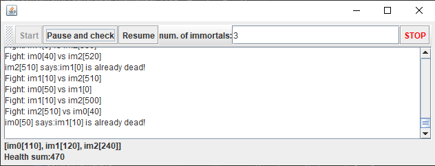
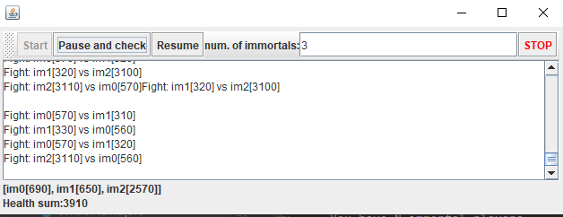
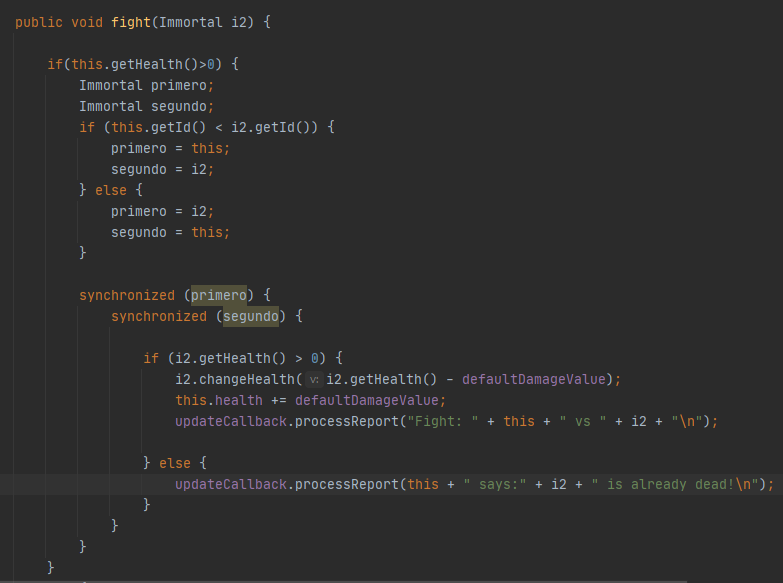
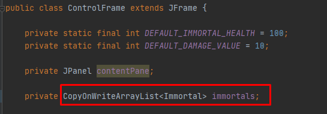
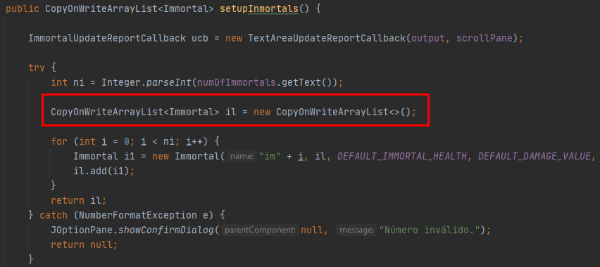
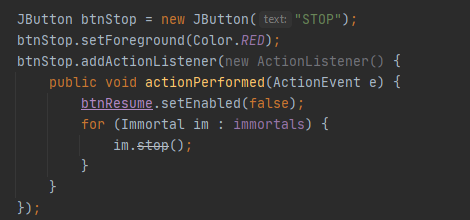

# Laboratorio 2 ARSW

### Parte 1.
>1. La clase encarda de que el consumo de la cpu sea alta es la clase Producer,
>ya que no tiene un control del stack de la cola y lo deja correr infinito
> 
>   
>
>2. Para que la cpu mejore lo que hicimos fue sincronizar la cola en el producer y notificar,
>y en la parte de consumer se syncroniza cuando se va a usar la cola.
>
>   
>   
>
>y la mejora se puede observar en la siguiente imagen, ya que la cpu tiene un consumo 
>mucho menor que la anterior ejecucion.
>
>   
>
>3. Para controlar el maximo del queue lo que hicimos fue que el tamaño de la cola no exceda el atributo Stock-Limit
>
>   
>
>Ademas verificamos que el consumo de la cpu no se afectara 
>
>   
>
## Parte 2
>
>1. Review the “highlander-simulator” program, provided in the edu.eci.arsw.highlandersim package. This is a game in which:
>
>   - You have N immortal players. 
>   - Each player knows the remaining N-1 player.
>   - Each player permanently attacks some other immortal. The one who first attacks subtracts M life points from his opponent, and increases his own life points by the same amount. 
>   - The game could never have a single winner. Most likely, in the end there are only two left, fighting indefinitely by removing and adding life points. 
>2. Review the code and identify how the functionality indicated above was implemented. Given the intention of the game, an invariant should be that the sum of the life points of all players is always the same (of course, in an instant of time in which a time increase / reduction operation is not in process ). For this case, for N players, what should this value be?
>
>   - Debaria ser N*100 que es el numero de jugadores * la vida, Segun el codigo antes de modificar seria 300 el total 
>3. Run the application and verify how the ‘pause and check’ option works. Is the invariant fulfilled?
>   - La funcion pausa y check no esta bien ya que cada vez que se da click en la opcion se puede ver que el total de la vida de todos los inmortales da mas de lo que debe y por eso no se cumple el invariante
>
>   - 
>   - 
>
>10. Se corrigio este problema, eliminando los innmoratles que ya estan muertos, bien sea el que ataca
>o el inmortal que es atacado, tambien ahora se realiza el bloqueo anidado, para mejorar el desempeño y no hacer
>peleas innecesarias.
>
>   - 
>  
>Tambien se cambio la lista de inmorates, a una lista concurrente que permite que las operaciones sobre la estrucutura
>de datos se hagan de manera concurrente y no secuencial como se realizaban anteriormente.
>
>   - 
>En el metodo setUpInmortals se cambia tambien la estrucutura de datos ya que es alli donde se instancia.
>
>   - 
>
>Finalmente se implemento el boton stop y la funcionalidad del mismo, este boton termina la ejucion del programa
>de la siguiente manera:

>   - 