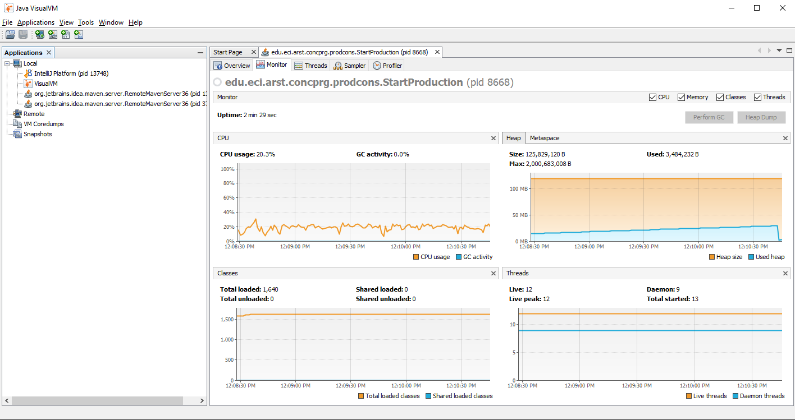
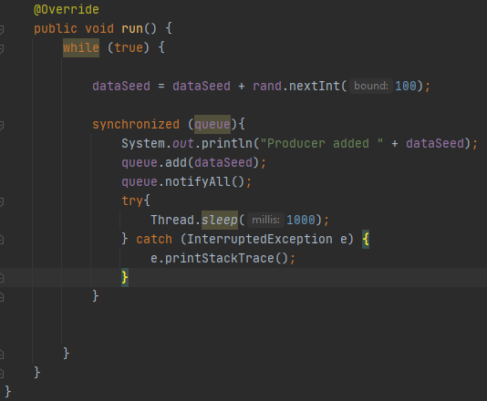
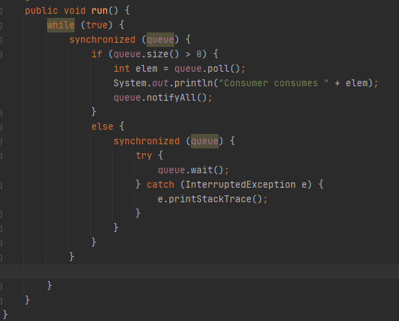
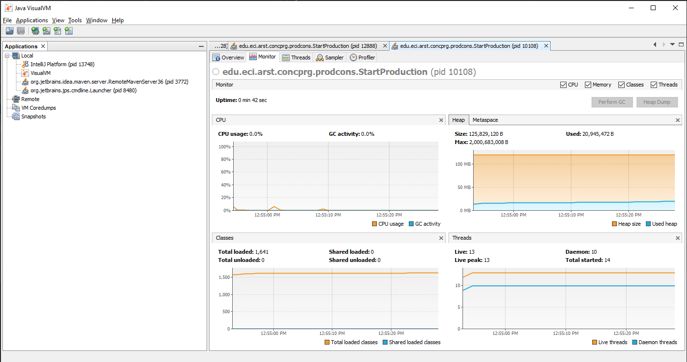
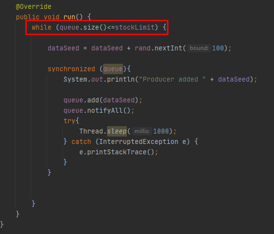
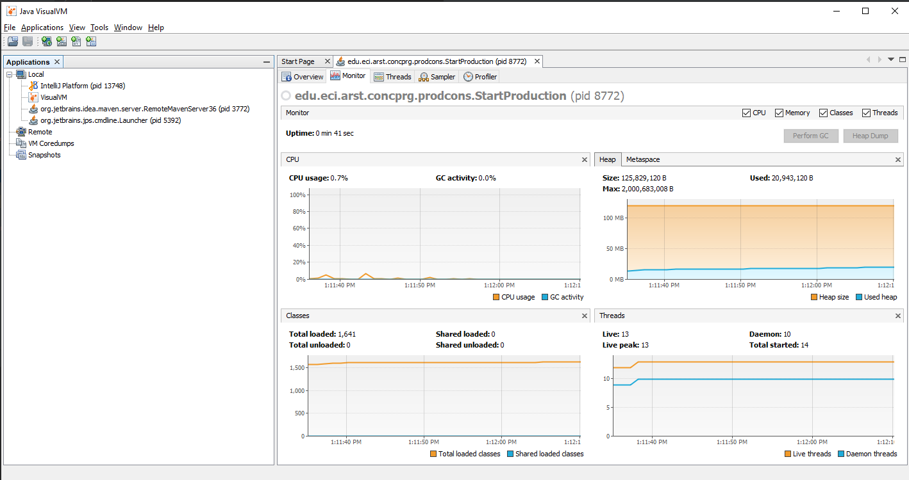

# Laboratorio 2 ARSW

### Parte 1.
>1. La clase encarda de que el consumo de la cpu sea alta es la clase Producer,
>ya que no tiene un control del stack de la cola y lo deja correr infinito 
>
>2. Para que la cpu mejore lo que hicimos fue sincronizar la cola en el producer y notificar,
>y en la parte de consumer se syncroniza cuando se va a usar la cola.
>
>
>y la mejora se puede observar en la siguiente imagen, ya que la cpu tiene un consumo 
>mucho menor que la anterior ejecucion.
>
>3. Para controlar el maximo del queue lo que hicimos fue que el tamaño de la cola no exceda el atributo Stock-Limit
> 
>Ademas verificamos que el consumo de la cpu no se afectara 
>